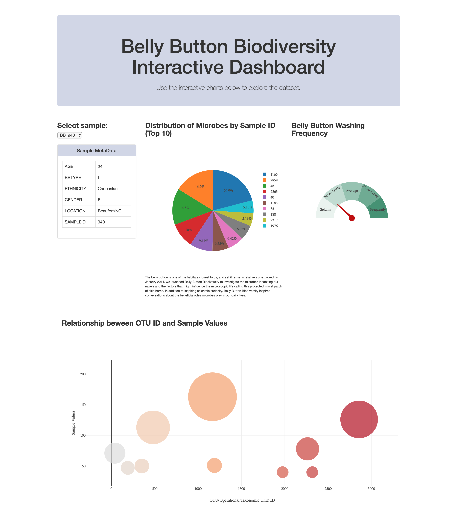

# Belly Button Biodiversity
## Full-Stack Data Analytics Web Application 

You can click [here](https://sean-biodiversity.herokuapp.com/) to access the web application deployed on Heroku.

### User Interface

### Background
#### The coolest study of biodiversity on the human body on the planet!
The belly button is one of the habitats closest to us, and yet it remains relatively unexplored. In January 2011, we launched Belly Button Biodiversity to investigate the microbes inhabiting our navels and the factors that might influence the microscopic life calling this protected, moist patch of skin home. In addition to inspiring scientific curiosity, Belly Button Biodiversity inspired conversations about the beneficial roles microbes play in our daily lives.

You can click [here](http://robdunnlab.com/projects/belly-button-biodiversity/) for more updates and information.

### Technology Stack Used:
⋅⋅* Pandas
⋅⋅* Flask MicroFrameWork
⋅⋅* SQLAlchemy
⋅⋅* Sqlite
⋅⋅* Javascript
⋅⋅* Python
⋅⋅* HTML/CSS/Bootstrap
⋅⋅* Plotly.js (Visualization)
⋅⋅* Heroku

